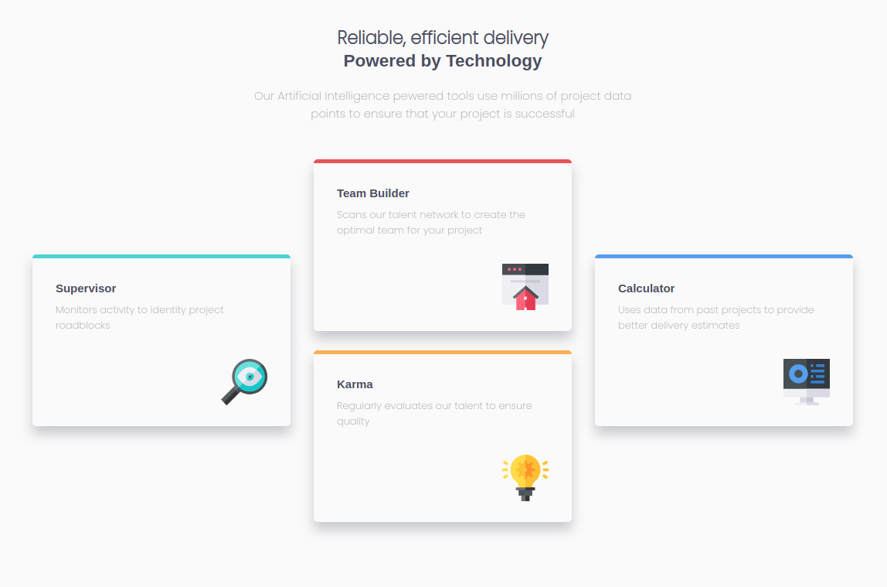

# Four Card Feature Section Master
https://fourcard01.netlify.app/

## Sobre o projeto

Esta é uma solução do frontend Mentor com o objetivo de construir uma "seção contendo quatro cartões" , e torná-lo o mais semelhante possível ao projeto original. Nele, o usuário deve ser capaz de visualizar o cartão em qualquer dispositivo.

## Layout Desktop

## layout Mobile

# Estilização utilizada

## Cores

### Primária

- Red: hsl(0, 78%, 62%)
- Cyan: hsl(180, 62%, 55%)
- Orange: hsl(34, 97%, 64%)
- Blue: hsl(212, 86%, 64%)

### Neutra

- Very Dark Blue: hsl(234, 12%, 34%)
- Grayish Blue: hsl(229, 6%, 66%)
- Very Light Gray: hsl(0, 0%, 98%)

## tipografia

### Body

- Font size: 15px

### Font

- Family: Poppins
- Weights: 200, 400, 600

# Tecnologias utilizadas

## Front end

- HTML / CSS 

Modelos de layout utilizados:

- GridLayout
- FlexBox

## Implantação em produção

- Front end web: Netlify

  https://fourcard01.netlify.app/
  
# Meu aprendizado neste projeto
  
  Nesta solução foquei na utilização do Grid Layout como modelo no meu css, com ele aprendi a usar o grid-template-columns ,grid-template-rows e o grid-template-areas que são bem dinâmicos na construção do layout e bem simples de utilizar. Mas também não pude deixar de utilizar o flexBox em conjunto para melhor performace do meu código. Também pude aprender o conceito de " mobile First " que mostra como é bem mais fácil e prático começar a estilização pelo mobile ao invés de começar pelo desktop.
  
# Autor

Wesley higino Pereira

https://www.linkedin.com/in/wesleyhigino/
